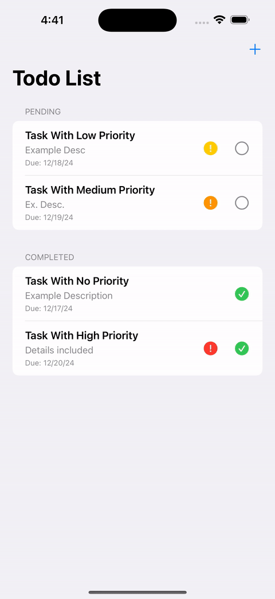
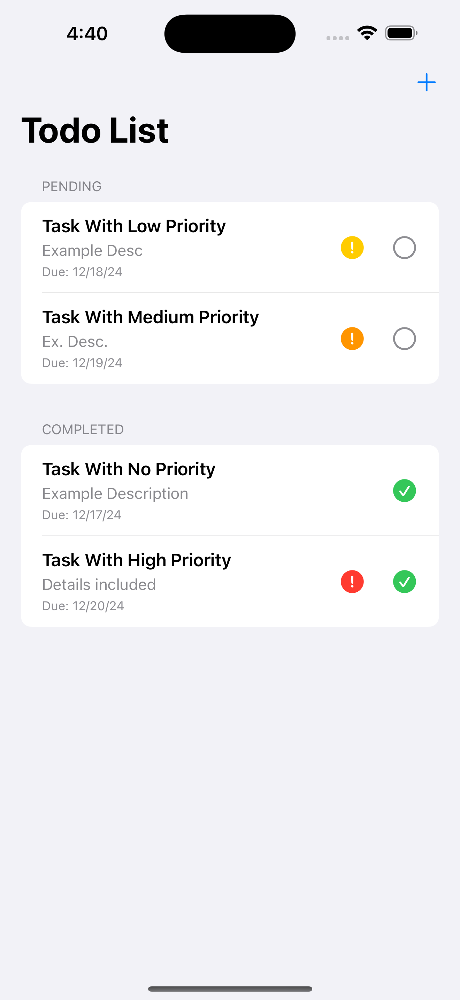
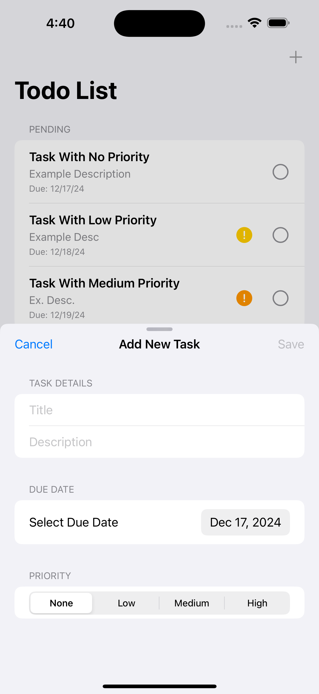
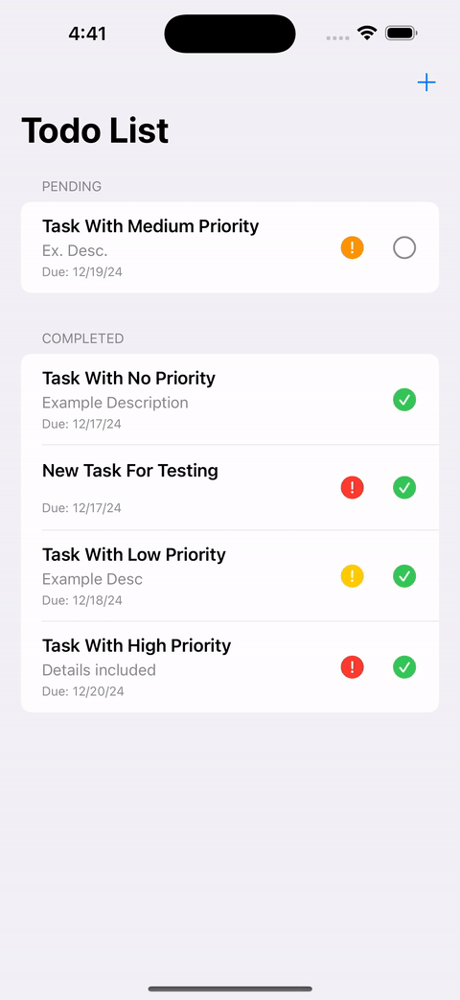

# ToDo || !ToDo App

A SwiftUI-based To-Do app that allows users to manage their tasks efficiently. Inspired by the native Reminders app, it offers a seamless experience with categorized task lists, priority settings, and more.

## Features

- **Add Tasks:** Create new tasks with title, description, due date, and priority.
- **Edit Tasks:** Modify existing tasks to update details. (Coming Soon)...
- **Delete Tasks:** Remove tasks from the list with swipe actions.
- **Categorization:** View tasks under "Pending" and "Completed" sections.
- **Priority Settings:** Assign priorities (None, Low, Medium, High) to tasks.
- **Smooth Animations:** Enjoy animated transitions and UI feedback. 

## Screenshots

## Installation Steps

### Clone the Repository:
` git clone https://github.com/BedoEbied/Todo-or-not-Todo.git `

### Open the Project in Xcode

#### Open Xcode

Launch Xcode from your Applications folder or using Spotlight Search.

#### Open the Project

1. **Go to** `File > Open...`
2. **Navigate** to the cloned `todoornottodo` directory.
3. **Select** `todoornottodo.xcodeproj` and click **Open**.

### Set Up Core Data

#### Core Data Model

Ensure the Core Data model (`todoornottodo.xcdatamodeld`) is correctly configured with the `Task` entity and its attributes.

#### Generate NSManagedObject Subclasses (Optional)

1. **Select** the entity in the data model editor.
2. **Go to** `Editor > Create NSManagedObject Subclass...`
3. **Follow** the prompts to generate the subclasses.

### Run the App

#### Select a Simulator or Device

Choose an iOS simulator or connect your physical device.

#### Build and Run

Click the **Run** button (▶️) in the toolbar or press `Command + R` to build and launch the app.

## Usage

### Adding a New Task

#### Tap the "+" Button

Located in the top-right corner of the main list view.

#### Fill in Task Details

- **Title:** Enter the task's title.
- **Description:** Optionally, provide a brief description.
- **Due Date:** Select a due date using the date picker.
- **Priority:** Choose the task's priority level (None, Low, Medium, High).

#### Save the Task

Tap the **Save** button to add the task to your list.

### Marking a Task as Completed

#### Tap the Completion Icon

Located next to each task, represented by an empty or filled checkmark circle.

#### Visual Feedback

- **Completed Tasks:** Display a blue filled checkmark circle.
- **Incomplete Tasks:** Show a gray empty circle without any text styling.

### Deleting a Task

#### Swipe Left on a Task

Reveal the **Delete** option.

#### Tap Delete

Remove the task from your list.

## Technologies Used

- **SwiftUI:** Utilized for building a declarative and responsive user interface.
- **Core Data:** Implemented for efficient data persistence and management.
- **SF Symbols:** Used for consistent and scalable iconography throughout the app.

## Future Improvements

- **Sorting and Searching:**
  - **Sorting:** Users can sort tasks based on due date or priority.
  - **Searching:** Integrated a search bar to filter tasks by title or description.
  
- **Local Notifications:**
  - Scheduled reminders for upcoming due dates to help users stay on track.
  
- **Haptic Feedback:**
  - Added tactile feedback when toggling task completion status to enhance user interaction.

- **Recurring Tasks:**
  - Implement functionality to allow tasks to repeat on a daily, weekly, or custom basis.
  
- **Collaboration:**
  - Enable users to share tasks or to-do lists with others for collaborative task management.
  
- **Themes and Customization:**
  - Offer multiple themes or color schemes to allow users to personalize the app's appearance.
  
- **Integration with Calendar:**
  - Sync tasks with the user's calendar to provide a unified view of tasks and events.
  
- **Advanced Notifications:**
  - Allow users to customize notification times and frequencies.
  
- **Task Prioritization Enhancements:**
  - Introduce more nuanced priority levels or additional indicators for task urgency.

## License

This project is licensed under the [MIT License](LICENSE).

## Acknowledgments

- **Apple Developer Documentation:** For providing comprehensive guides and resources on SwiftUI and Core Data.
- **SF Symbols:** For offering a vast collection of scalable icons used throughout the app.
- **SwiftUI Community:** For the support and shared knowledge that facilitated the development process.

## Contact

For any questions, suggestions, or feedback, please feel free to reach out:

- **Email:** abdelrahmanm.ebied@gmail.com
- **GitHub** github.com/bedoebied
